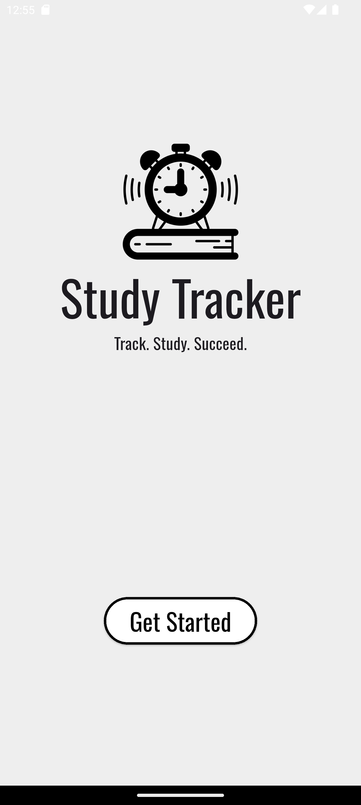
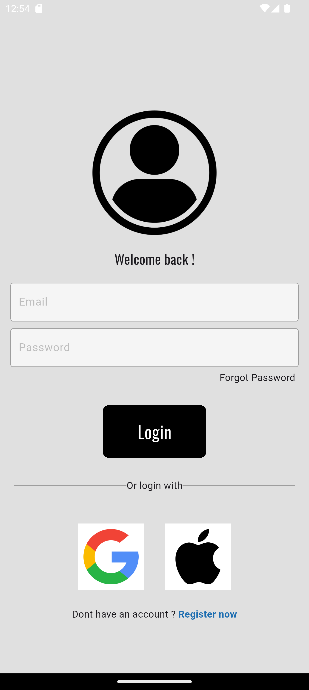
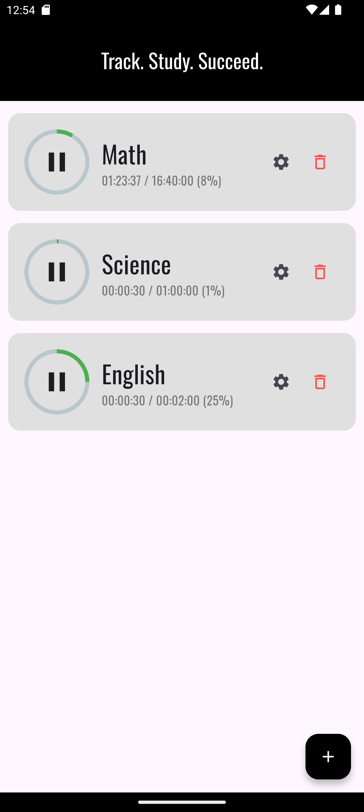
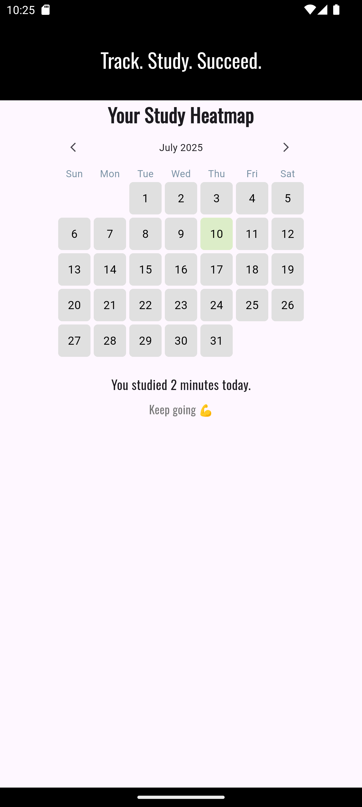

# 📚 Study Tracker App

A minimal, Firebase-powered study tracking app built with Flutter.  
Helps students stay organized by logging subjects and tracking study time.

---

## 🧭 Navigation Flow

Welcome Page ➜ Login / Signup (Firebase Auth) ➜ Home Page ➜ Add Subject & Heatmap

---

## 🚀 Features

- ✅ Welcome screen with branding
- ✅ Firebase Authentication (Email/Password)
- ✅ Home screen with subject overview
- ✅ Add new study subjects
- ✅ Responsive design for phone/tablet
- 🔄 Save data using Firebase Firestore

---

## 🛠️ Tech Stack

- **Flutter** – Frontend framework
- **Dart** – Programming language
- **Firebase** – Backend-as-a-Service
  - Authentication
  - Firestore Database
- **State Management** – setState (for now)

## 📱 Screenshots

### 👋 Welcome Screen
<p align="center">
  
</p>

### 🔐 Login Screen
<p align="center">
  
</p>

### 🏠 Home Screen
<p align="center">
  
</p>

### ➕ Heatmap Page
<p align="center">
  
</p>

---

## 🔧 Getting Started

### Requirements

- Flutter SDK
- Android Studio or VS Code
- Firebase project (see setup below)

### Run Locally

```bash
git clone https://github.com/mostafa/study-tracker.git

cd study-tracker

flutter pub get

flutterfire configure

flutter run
